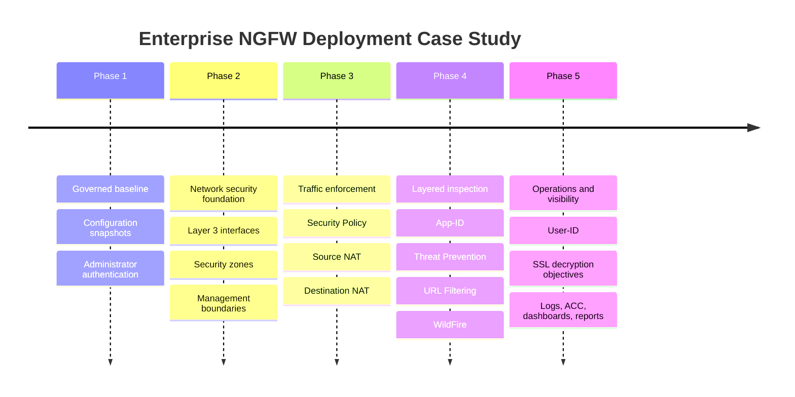
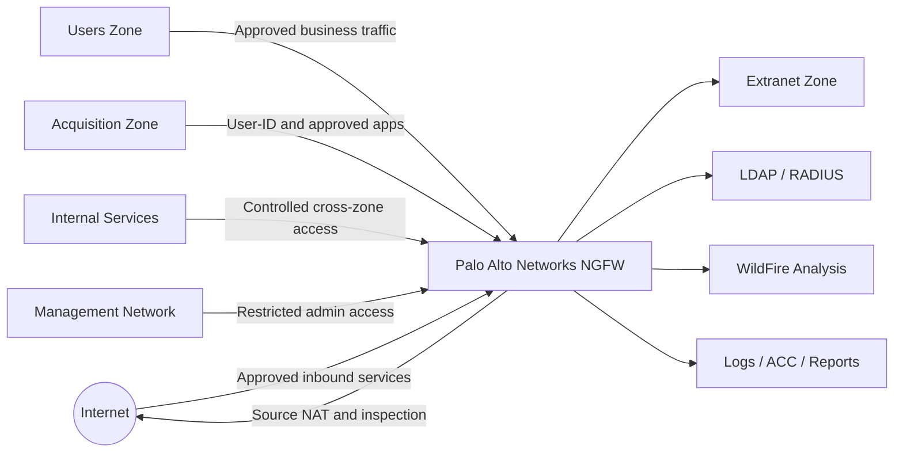

# Enterprise Firewall Security Implementation with Palo Alto NGFW

## Enterprise Firewall Security Engineering Portfolio Case Study

This repository presents a controlled-lab enterprise firewall implementation using Palo Alto Networks NGFW capabilities. It demonstrates how segmentation, least-privilege policy, NAT, App-ID, URL Filtering, WildFire, User-ID, SSL decryption objectives, and operational reporting work together in a modern firewall security program.

> [!NOTE]
> This is a portfolio case study built from sanitized lab evidence, screenshots, and documented PAN-OS objectives. It does not claim production access or a live customer deployment.

---

## Case Study Snapshot

| Portfolio Metric | Evidence-Grounded Value |
|---|---:|
| Firewall capability areas documented | 12 |
| Palo Alto evidence screenshots included | 10 |
| Main technical evidence screenshots | 9 |
| Completion-only screenshots separated | 1 |
| Enterprise deployment phases documented | 5 |
| Copyrighted lab PDFs republished | 0 |

## Business Scenario

A growing enterprise required a modern next-generation firewall implementation capable of enforcing least-privilege access, application-aware inspection, identity-based policy, advanced threat prevention, and operational visibility across multiple security zones.

The environment modeled internal users, an acquisition network, internal services, extranet resources, administrator access, and internet-bound traffic. The firewall needed to demonstrate controlled access between trust boundaries while producing enough log and report evidence for security validation.

## Key Security Capabilities

| Capability | Capability | Capability |
|---|---|---|
| ✔ Security Zones | ✔ Layer 3 Interfaces | ✔ Virtual Router |
| ✔ Security Policy | ✔ Source NAT | ✔ Destination NAT |
| ✔ App-ID | ✔ Threat Prevention | ✔ URL Filtering |
| ✔ WildFire | ✔ User-ID | ✔ SSL Decryption Objectives |
| ✔ Traffic Logging | ✔ ACC Reporting | ✔ Dashboard Analytics |

---

## Deployment Timeline

## Target Architecture

> [!IMPORTANT]
> Configuration screenshots are included only where evidence exists. Where screenshots are missing, the repository uses objective-supported language such as documented, demonstrated, and validated in a controlled lab.

---

## Implementation Phases

### Phase 1: Establish a Governed Firewall Baseline

The case study begins with operational control of the firewall: baseline loading, named configuration snapshots, export and revert workflows, configuration previews, and System/Configuration log review. Administrator access objectives include local administrators, LDAP, RADIUS, authentication profiles, and authentication sequencing.

Evidence basis: Lab 02 and Lab 03 objectives, plus available authentication-related evidence.

### Phase 2: Build the Network Security Foundation

The firewall model uses routed interfaces, security zones, a virtual router, and interface management profiles to separate traffic by trust boundary and reduce unnecessary management exposure.

Evidence basis: Lab 04 objectives and available segmentation evidence.

<figure>
  
  <figcaption><strong>Figure 1:</strong> Segmentation evidence demonstrating zone-based firewall validation. This supports the core security concept that traffic should be evaluated at trust boundaries instead of treated as one flat network.</figcaption>
</figure>

### Phase 3: Enforce Traffic Flow with Policy and NAT

Security Policy and NAT form the traffic-control layer. The documented scope includes user-to-extranet access, internet-bound rules, policy hit-count review, logging, source NAT, and destination NAT.

Evidence basis: Lab 05 and Lab 06 objectives, plus available policy and NAT validation screenshots.

<figure>
  
  <figcaption><strong>Figure 2:</strong> Traffic validation evidence for Security Policy behavior. This matters because firewall rules should be verified through observed traffic, not only assumed from configuration intent.</figcaption>
</figure>

<figure>
  
  <figcaption><strong>Figure 3:</strong> NAT validation evidence demonstrating translated traffic behavior. This supports the perimeter security concept of controlling how internal and published services are represented across trust boundaries.</figcaption>
</figure>

### Phase 4: Add Layered Inspection and Application Control

The inspection layer adds App-ID, Security Profiles, URL Filtering, and WildFire. This moves the firewall model beyond basic port filtering into application-aware and content-aware enforcement.

Evidence basis: Lab 07, Lab 08, Lab 09, and Lab 10 objectives, plus available threat-prevention, URL filtering, and WildFire evidence.

<figure>
  
  <figcaption><strong>Figure 4:</strong> Threat-prevention evidence showing validation of inspection controls. This demonstrates the principle that allowed traffic still needs security inspection for malware, spyware, and vulnerability activity.</figcaption>
</figure>

<figure>
  
  <figcaption><strong>Figure 5:</strong> URL filtering evidence supporting category-based web control. This validates web security enforcement beyond IP and port rules by evaluating the destination category and policy action.</figcaption>
</figure>

<figure>
  
  <figcaption><strong>Figure 6:</strong> WildFire evidence supporting unknown-file analysis workflow. This demonstrates how the firewall can extend inspection to files that require malware verdict analysis instead of relying only on static rule decisions.</figcaption>
</figure>

### Phase 5: Operationalize Identity, Decryption, and Reporting

The final phase demonstrates identity-aware access, SSL decryption objectives, and operational visibility. User-ID supports group-aware policy decisions. SSL decryption objectives include certificate handling, outbound decryption policy, log review, and no-decrypt exceptions for sensitive categories. Reporting objectives include Dashboard, ACC, Traffic logs, Threat logs, App Scope, predefined reports, and custom reports.

Evidence basis: Lab 11, Lab 12, and Lab 13 objectives, plus available group and reporting evidence. Direct decryption configuration screenshots are not present, so SSL decryption is documented as objective-supported rather than screenshot-proven.

<figure>
  
  <figcaption><strong>Figure 7:</strong> Group evidence supporting identity-aware policy design. This matters because enterprise firewall access should often be based on user and group context, not only source IP address.</figcaption>
</figure>

<figure>
  
  <figcaption><strong>Figure 8:</strong> Reporting evidence supporting application visibility and operational review. This validates the security operations requirement to turn firewall activity into reviewable dashboards, reports, and investigation data.</figcaption>
</figure>

---

## Evidence Gallery

| Evidence Area | Screenshot | What It Supports |
|---|---|---|
| Authentication | `screenshots/palo-alto/authentication/administrator-authentication-evidence.png` | Administrator authentication workflow evidence |
| User-ID | `screenshots/palo-alto/authentication/user-id-group-evidence.png` | Group-based access-control evidence |
| Segmentation | `screenshots/palo-alto/security-policy/security-zones-validation.png` | Security zone validation evidence |
| Security Policy | `screenshots/palo-alto/security-policy/security-policy-traffic-validation.png` | Policy traffic validation evidence |
| NAT | `screenshots/palo-alto/nat/nat-traffic-validation.png` | NAT validation evidence |
| Threat Prevention | `screenshots/palo-alto/threat-prevention/threat-prevention-log.png` | Threat-prevention validation evidence |
| URL Filtering | `screenshots/palo-alto/url-filtering/url-filtering-block-log.png` | URL filtering validation evidence |
| WildFire | `screenshots/palo-alto/wildfire/wildfire-analysis-evidence.png` | WildFire analysis evidence |
| Reporting | `screenshots/palo-alto/reporting/custom-report-apps-used.png` | Reporting and application visibility evidence |

> [!TIP]
> Completion-only evidence is stored separately in `screenshots/palo-alto/completion-evidence/` so technical validation screenshots remain distinct from score or completion proof.

## Technologies and Security Concepts

| Area | Concepts Demonstrated |
|---|---|
| PAN-OS administration | Configuration snapshots, export, revert, preview, system/config logs |
| Access control | Local admin, LDAP, RADIUS, authentication profiles, authentication sequence |
| Segmentation | Security zones, Layer 3 interfaces, virtual router, management profiles |
| Policy enforcement | Security Policy, policy hit counts, interzone/intrazone logging |
| NAT | Source NAT, destination NAT, traffic-log validation |
| Application security | App-ID, application groups, shadowed-rule review |
| Threat prevention | Security profiles, Security Profile Groups, Threat log validation |
| Web security | URL categories, URL Filtering Profile, blocked-site validation |
| Malware analysis | WildFire Analysis Profile and analysis review |
| Identity-aware policy | User-ID and group-based access control |
| Encrypted traffic | SSL Forward Proxy objectives and no-decrypt privacy exceptions |
| Operations | Dashboard, ACC, App Scope, predefined reports, custom reports |

## Engineering Outcomes

- Demonstrated a phase-based NGFW deployment model from baseline administration through monitoring and reporting.
- Validated segmentation, policy, NAT, threat-prevention, URL filtering, WildFire, identity, and reporting concepts using available evidence.
- Organized firewall screenshots by security capability so reviewers can quickly understand the control objective behind each artifact.
- Separated completion evidence from technical validation evidence to keep the portfolio credible and easy to audit.
- Documented evidence gaps clearly, turning missing screenshots into a practical capture list instead of overstating the project.

## Skills Demonstrated

- Palo Alto NGFW security engineering
- Enterprise firewall architecture documentation
- Security zone and segmentation design
- Security Policy and NAT validation
- App-ID and application-aware policy design
- Threat-prevention and URL filtering validation
- WildFire analysis workflow documentation
- User-ID and group-aware access-control explanation
- SSL decryption planning with privacy exceptions
- Firewall log, reporting, and evidence organization

## Resume Bullets

- Documented a Palo Alto NGFW enterprise firewall case study covering security zones, routed interfaces, Security Policy, NAT, App-ID, URL Filtering, WildFire, User-ID, SSL decryption objectives, and operational reporting.
- Validated firewall security controls in a controlled lab using available evidence from traffic validation, NAT behavior, threat-prevention logs, URL filtering, WildFire analysis, identity/group context, and reporting workflows.
- Built a recruiter-ready cybersecurity portfolio repository with architecture diagrams, deployment phases, evidence mapping, security outcomes, and clearly documented evidence boundaries.

## Evidence Gaps to Capture Next

The current repository is grounded in available screenshots and lab objectives. To strengthen the case study further, capture these manually if lab access is available:

- Security Policy rulebase screenshot.
- NAT Policy rulebase screenshot.
- App-ID application group and matching Traffic log.
- URL Filtering Profile page.
- WildFire Analysis Profile and verdict/log.
- User-ID mapping and user-attributed Traffic log.
- SSL Decryption Policy and certificate pages.
- No-decrypt rule for sensitive categories.
- ACC dashboard and App Scope report views.

## Lab Reference Boundary

The implementation narrative is informed by controlled PAN-OS lab objectives for configuration management, administrator authentication, security zones, Security Policy, NAT, App-ID, Security Profiles, URL Filtering, WildFire, User-ID, SSL Decryption, and Logs/Reports. Copyrighted lab PDFs are not republished; see [lab-guides/README.md](lab-guides/README.md) for the topic list.

## Professional Disclaimer

This repository is a cybersecurity portfolio case study completed in a controlled lab environment with sanitized evidence. It demonstrates firewall engineering concepts and validation workflows, but it should not be interpreted as a production customer deployment or as containing live enterprise configuration data.
