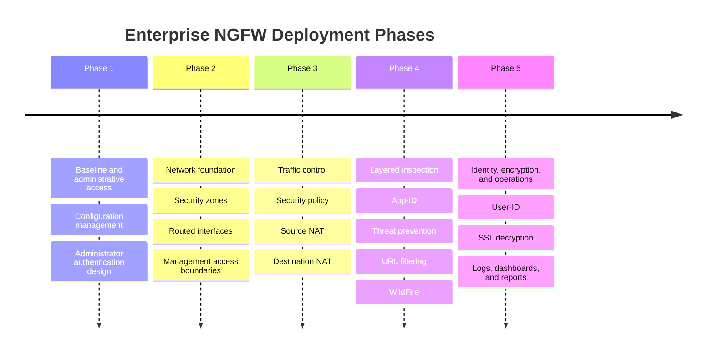
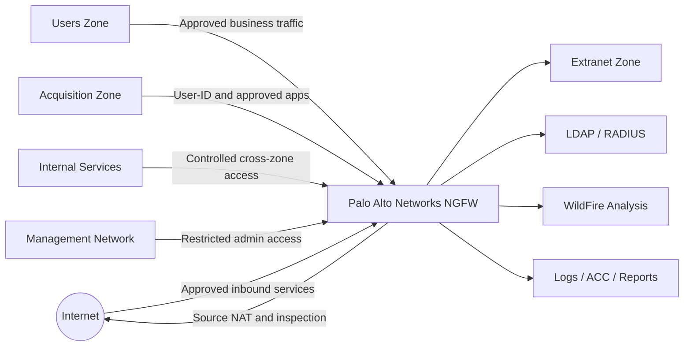

# Enterprise Firewall Security Implementation with Palo Alto NGFW

## Case Study Snapshot

This project presents a controlled enterprise firewall implementation using Palo Alto Networks NGFW capabilities. The scenario models a security team preparing a firewall for production use: segmenting networks, controlling application access, validating NAT, adding threat prevention, enforcing URL controls, enabling identity-aware policy, planning SSL decryption, and building operational visibility through logs and reports.

The repository is intentionally written as a portfolio case study. It uses the evidence available in this folder and avoids claiming production access or configuration screenshots that are not present.

| Portfolio Metric | Evidence-Grounded Value |
|---|---:|
| Firewall capability areas documented | 12 |
| Palo Alto evidence screenshots included | 10 |
| Main technical evidence screenshots | 9 |
| Completion-only screenshots separated | 1 |
| Deployment phases documented | 5 |
| Lab guide PDFs republished | 0 |

## Business Scenario

A growing organization is preparing to harden its perimeter and internal access controls with a Palo Alto Networks NGFW. The environment includes internal users, an acquisition network, internal services, extranet resources, administrative access, and internet-bound traffic.

The security team needs the firewall to support:

- Segmented access between trust zones.
- Controlled outbound access through NAT and security policy.
- Application-aware enforcement using App-ID.
- Web access control using URL categories.
- Threat inspection for allowed traffic.
- Unknown-file analysis through WildFire.
- User and group-aware access decisions.
- SSL decryption planning with privacy exceptions.
- Reporting and log review for validation.

## Deployment Timeline

## Target Architecture

## Implementation Phases

### Phase 1: Establish a Governed Firewall Baseline

The project starts with configuration management and administrative access control. The supporting lab objectives include baseline loading, named snapshots, export/revert workflows, configuration previews, System and Configuration log review, local administrator accounts, LDAP, RADIUS, authentication profiles, and authentication sequencing.

Evidence basis: Lab 02 and Lab 03 objectives, plus available authentication-related evidence.

### Phase 2: Build the Network Security Foundation

The firewall design uses routed interfaces, security zones, a virtual router, and interface management profiles. The purpose is to separate traffic by trust boundary and limit management exposure.

Evidence basis: Lab 04 objectives and available segmentation evidence.

<figure>
  
  <figcaption>Figure 1: Available evidence supporting zone-based segmentation and firewall validation.</figcaption>
</figure>

### Phase 3: Enforce Traffic Flow with Policy and NAT

Security policy and NAT are treated as the control layer for business traffic. The implementation scope includes user-to-extranet access, internet-bound policy, policy hit-count review, logging, source NAT, and destination NAT.

Evidence basis: Lab 05 and Lab 06 objectives, plus available traffic and NAT validation evidence.

<figure>
  
  <figcaption>Figure 2: Available evidence supporting security policy traffic validation.</figcaption>
</figure>

<figure>
  
  <figcaption>Figure 3: Available evidence supporting NAT validation.</figcaption>
</figure>

### Phase 4: Add Layered Inspection and Application Control

The inspection layer adds App-ID, Security Profiles, URL Filtering, and WildFire. This moves the design beyond basic allow/deny rules by validating application behavior, web categories, known-threat controls, and unknown-file analysis.

Evidence basis: Lab 07, Lab 08, Lab 09, and Lab 10 objectives, plus available threat-prevention, URL filtering, and WildFire evidence.

<figure>
  
  <figcaption>Figure 4: Available evidence supporting threat-prevention validation.</figcaption>
</figure>

<figure>
  
  <figcaption>Figure 5: Available evidence supporting URL filtering validation.</figcaption>
</figure>

<figure>
  
  <figcaption>Figure 6: Available evidence supporting WildFire analysis validation.</figcaption>
</figure>

### Phase 5: Operationalize Identity, Decryption, and Reporting

The final phase adds User-ID, SSL decryption planning, and operational reporting. User-ID supports group-aware access decisions for acquisition users and marketing access requirements. SSL decryption objectives cover trusted/untrusted certificates, browser trust, outbound decryption policy, log review, and no-decrypt exceptions for sensitive categories. Reporting objectives include Dashboard, ACC, Traffic logs, Threat logs, App Scope, predefined reports, and custom reports.

Evidence basis: Lab 11, Lab 12, and Lab 13 objectives, plus available group and reporting evidence. Direct decryption configuration screenshots are not present, so decryption is documented as objective-supported rather than screenshot-proven.

<figure>
  
  <figcaption>Figure 7: Available evidence supporting group-based access-control concepts.</figcaption>
</figure>

<figure>
  
  <figcaption>Figure 8: Available evidence supporting reporting and application visibility.</figcaption>
</figure>

## Evidence Gallery

| Evidence Area | Screenshot | What It Supports |
|---|---|---|
| Authentication | `screenshots/palo-alto/authentication/administrator-authentication-evidence.png` | Administrator authentication workflow evidence |
| User-ID | `screenshots/palo-alto/authentication/user-id-group-evidence.png` | Group-based access-control evidence |
| Segmentation | `screenshots/palo-alto/security-policy/security-zones-validation.png` | Security zone validation evidence |
| Security Policy | `screenshots/palo-alto/security-policy/security-policy-traffic-validation.png` | Policy traffic validation evidence |
| NAT | `screenshots/palo-alto/nat/nat-traffic-validation.png` | NAT validation evidence |
| Threat Prevention | `screenshots/palo-alto/threat-prevention/threat-prevention-log.png` | Threat-prevention validation evidence |
| URL Filtering | `screenshots/palo-alto/url-filtering/url-filtering-block-log.png` | URL filtering validation evidence |
| WildFire | `screenshots/palo-alto/wildfire/wildfire-analysis-evidence.png` | WildFire analysis evidence |
| Reporting | `screenshots/palo-alto/reporting/custom-report-apps-used.png` | Reporting and application visibility evidence |

Completion-only evidence is stored separately in `screenshots/palo-alto/completion-evidence/` and is not used as the main technical proof.

## Technologies and Security Concepts

| Area | Concepts Demonstrated |
|---|---|
| PAN-OS administration | Configuration snapshots, export, revert, preview, system/config logs |
| Access control | Local admin, LDAP, RADIUS, authentication profiles, authentication sequence |
| Segmentation | Security zones, Layer 3 interfaces, virtual router, management profiles |
| Policy enforcement | Security Policy, policy hit counts, interzone/intrazone logging |
| NAT | Source NAT, destination NAT, traffic-log validation |
| Application security | App-ID, application groups, shadowed-rule review |
| Threat prevention | Security profiles, Security Profile Groups, Threat log validation |
| Web security | URL categories, URL Filtering Profile, blocked-site validation |
| Malware analysis | WildFire Analysis Profile and analysis review |
| Identity-aware policy | User-ID and group-based access control |
| Encrypted traffic | SSL Forward Proxy objectives and no-decrypt privacy exceptions |
| Operations | Dashboard, ACC, App Scope, predefined reports, custom reports |

## Outcomes

- Converted isolated firewall artifacts into a cohesive enterprise deployment case study.
- Organized evidence by security function instead of by assignment or lab number.
- Separated completion screenshots from technical validation screenshots.
- Documented security controls with honest evidence boundaries.
- Produced recruiter-friendly documentation, resume bullets, LinkedIn content, and interview preparation.

## Skills Demonstrated

- Palo Alto NGFW security engineering
- Enterprise firewall architecture documentation
- Security zone and segmentation design
- Security Policy and NAT validation
- App-ID and application-aware policy design
- Threat-prevention and URL filtering validation
- WildFire analysis workflow documentation
- User-ID and group-aware access-control explanation
- SSL decryption planning with privacy exceptions
- Firewall log, reporting, and evidence organization

## Resume Bullets

- Designed and documented a Palo Alto NGFW enterprise security case study covering segmentation, Security Policy, NAT, App-ID, URL Filtering, WildFire, User-ID, SSL decryption objectives, and reporting.
- Organized sanitized firewall evidence into a recruiter-ready portfolio with architecture diagrams, deployment phases, validation screenshots, measurable scope, and evidence boundaries.
- Validated firewall control objectives using available traffic, NAT, threat-prevention, URL filtering, WildFire, authentication, User-ID, and reporting evidence from a controlled lab environment.

## Evidence Gaps to Capture Next

The current repository is grounded in available screenshots and lab objectives. To strengthen the case study further, capture these manually if you still have lab access:

- Security Policy rulebase screenshot.
- NAT Policy rulebase screenshot.
- App-ID application group and matching Traffic log.
- URL Filtering Profile page.
- WildFire Analysis Profile and verdict/log.
- User-ID mapping and user-attributed Traffic log.
- SSL Decryption Policy and certificate pages.
- No-decrypt rule for sensitive categories.
- ACC dashboard and App Scope report views.

## Disclaimer

This project was completed in a controlled lab environment using sanitized evidence. It is presented as a cybersecurity portfolio case study, not as a production customer deployment. Copyrighted lab PDFs are not republished; [lab-guides/README.md](lab-guides/README.md) lists the lab topics that informed the project.
