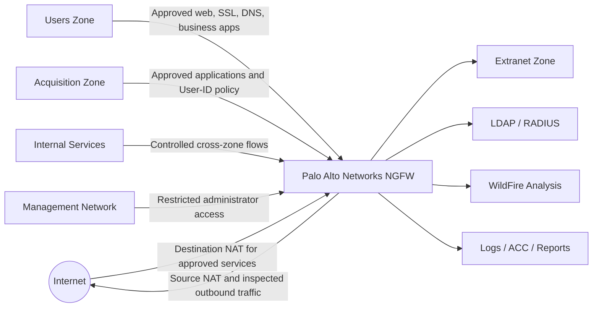
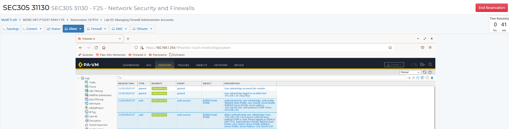
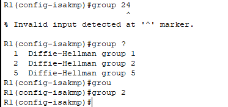
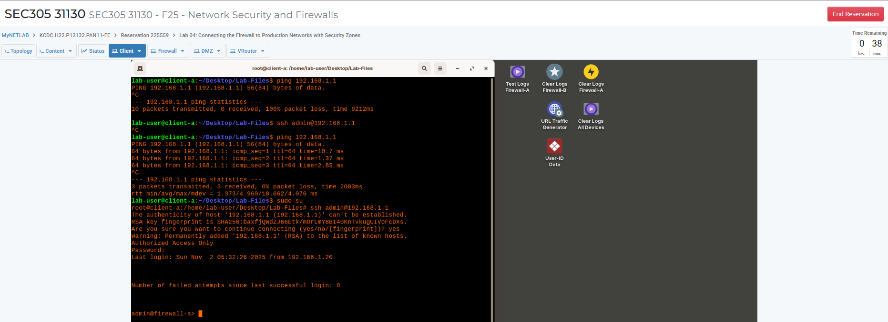
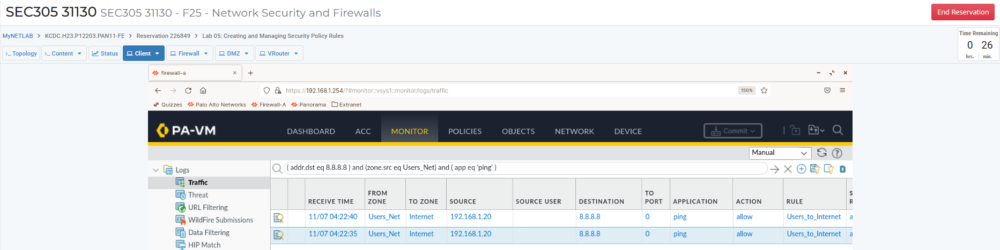
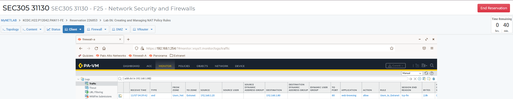
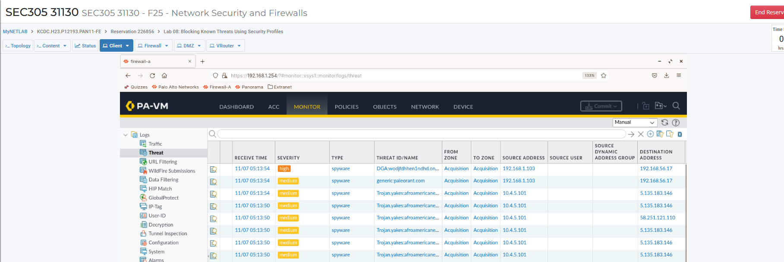
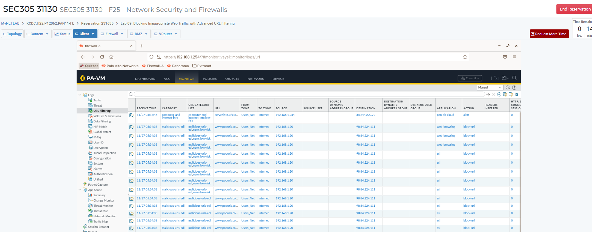
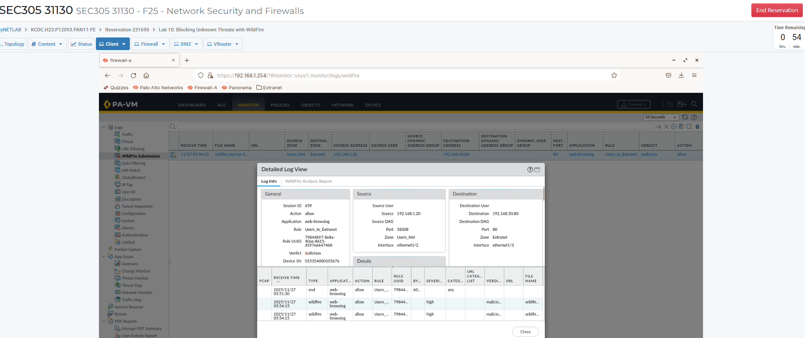
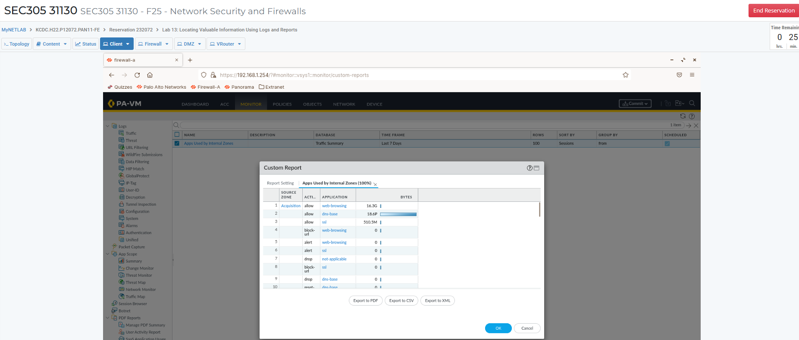

# Enterprise Firewall Security Implementation with Palo Alto NGFW

## Executive Summary

This portfolio project documents an enterprise firewall security implementation using Palo Alto Networks NGFW capabilities in a controlled lab environment. The deployment case study covers firewall configuration management, administrator authentication, network segmentation, security policy design, NAT, App-ID, threat prevention, URL filtering, WildFire analysis, User-ID, SSL decryption, and operational monitoring.

The project is presented as a professional security engineering implementation. Evidence is sanitized and limited to artifacts available in this repository. Where configuration screenshots are not available, the work is described as validated through lab objectives, logs, reports, and available evidence rather than as production configuration proof.

## Architecture

The architecture uses security zones to separate user, acquisition, extranet, internal service, management, and untrusted network segments. Security policy and NAT policy provide controlled access, while App-ID, URL Filtering, WildFire, User-ID, SSL decryption, and threat-prevention profiles provide layered inspection and enforcement.

See [assets/architecture-diagram.md](assets/architecture-diagram.md) and [docs/architecture.md](docs/architecture.md).

## Technologies Used

- Palo Alto Networks PAN-OS
- Palo Alto NGFW Security Policy
- Security Zones and Layer 3 interfaces
- Virtual Router and interface management profiles
- Source NAT and Destination NAT
- App-ID and application groups
- Security Profile Groups
- Antivirus, Anti-Spyware, and Vulnerability Protection concepts
- Advanced URL Filtering
- WildFire analysis
- User-ID and group-aware policy
- SSL Forward Proxy decryption
- No-decrypt policy exceptions
- Traffic, Threat, URL, System, Configuration, and WildFire logs
- ACC, Dashboard, App Scope, predefined reports, and custom reports

## Security Controls Implemented

| Control Area | Professional Implementation Summary | Evidence Basis |
|---|---|---|
| Configuration management | Baseline configuration, named snapshots, export, revert, preview, and log filtering workflows | Lab 02 objectives |
| Administrator authentication | Local admin, LDAP, RADIUS, authentication profiles, and authentication sequence design | Lab 03 objectives and available authentication evidence |
| Segmentation | Layer 3 interfaces, security zones, virtual router, and interface management profiles | Lab 04 objectives and available zone evidence |
| Security policy | Least privilege rules, traffic validation, rule hit counts, and logging | Lab 05 objectives and available policy validation evidence |
| NAT | Source NAT and destination NAT policy validation | Lab 06 objectives and available NAT evidence |
| App-ID | Application-based policy and application group enforcement | Lab 07 objectives |
| Threat prevention | Security profiles and Security Profile Group enforcement on allowed traffic | Lab 08 objectives and available threat-prevention evidence |
| URL filtering | Category-based web access control and malicious/inappropriate site blocking | Lab 09 objectives and available URL filtering evidence |
| WildFire | Unknown-file analysis workflow using WildFire profile and logs | Lab 10 objectives and available WildFire evidence |
| User-ID | Group-aware access control for acquisition users and marketing access requirements | Lab 11 objectives and available group evidence |
| SSL decryption | SSL Forward Proxy, certificate handling, and no-decrypt exceptions for sensitive categories | Lab 12 objectives |
| Monitoring and reporting | Dashboard, ACC, Traffic/Threat logs, App Scope, predefined reports, and custom reports | Lab 13 objectives and available reporting evidence |

## Project Evidence

The following screenshots are included because they map to the strongest available evidence in the folder. Completion-only evidence is stored separately under `screenshots/palo-alto/completion-evidence`.

### Authentication and User-ID Evidence

Evidence supporting administrator authentication workflows and authentication-related validation.

Evidence supporting group-based access control concepts used in the User-ID portion of the implementation.

### Segmentation and Security Policy Evidence

Evidence supporting segmentation and zone-based firewall design.

Evidence supporting policy validation and traffic testing.

### NAT Evidence

Evidence supporting source NAT and destination NAT validation.

### Threat Prevention Evidence

Evidence supporting security profile and threat-prevention validation.

### URL Filtering Evidence

Evidence supporting URL filtering and blocked web-category validation.

### WildFire Evidence

Evidence supporting WildFire analysis workflow validation.

### Reporting Evidence

Evidence supporting reporting, application visibility, and operational review.

## Skills Demonstrated

- Built a professional NGFW implementation narrative from validated technical artifacts.
- Designed segmented firewall architecture using security zones and routed interfaces.
- Mapped business requirements to least privilege security policy.
- Validated NAT and security policy behavior using available traffic evidence.
- Applied application-aware firewall design using App-ID objectives.
- Documented threat-prevention, URL filtering, and WildFire inspection workflows.
- Explained User-ID and group-based access control in an enterprise access model.
- Documented SSL Forward Proxy decryption with privacy-aware no-decrypt exceptions.
- Organized firewall evidence into recruiter-friendly documentation.
- Identified missing screenshots honestly and converted them into a manual evidence checklist.

## Lessons Learned

- Enterprise firewall work is more than allowing or blocking ports; effective policy uses zones, applications, users, categories, and inspection profiles.
- Firewall configuration evidence should be separated from completion evidence so reviewers can distinguish technical proof from score/completion pages.
- Logs and reports are essential validation tools when configuration screenshots are incomplete.
- SSL decryption adds inspection value but requires careful certificate handling and privacy exceptions.
- User-ID improves policy precision by connecting firewall decisions to real users and groups.
- A professional portfolio should avoid overstating evidence and should clearly identify gaps.

## Resume Bullets

- Designed and documented a Palo Alto NGFW enterprise security implementation covering segmentation, security policy, NAT, App-ID, URL Filtering, WildFire, User-ID, SSL decryption, and reporting.
- Validated firewall control objectives using sanitized evidence from traffic validation, threat-prevention, URL filtering, WildFire, authentication, and reporting workflows.
- Built recruiter-ready security documentation including architecture diagrams, implementation summaries, validation evidence mapping, lessons learned, interview preparation, and resume bullets.

See [docs/resume-bullets.md](docs/resume-bullets.md) for expanded resume options.

## Disclaimer

This project was completed in a controlled lab environment using sanitized evidence. It is presented as a professional cybersecurity portfolio case study, not as a production customer deployment. Copyrighted lab PDFs are not republished in this repository; the [lab-guides README](lab-guides/README.md) lists the lab topics that informed the implementation.

