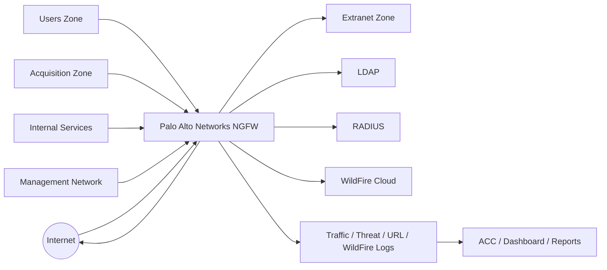

# Architecture Diagram

```mermaid
flowchart LR
    Internet((Internet))
    NGFW[Palo Alto Networks NGFW]
    Users[Users Zone]
    Acquisition[Acquisition Zone]
    Extranet[Extranet Zone]
    Internal[Internal Services]
    Mgmt[Management Network]
    LDAP[LDAP]
    RADIUS[RADIUS]
    WildFire[WildFire Cloud]
    Logs[Traffic / Threat / URL / WildFire Logs]
    Reports[ACC / Dashboard / Reports]

    Users --> NGFW
    Acquisition --> NGFW
    Internal --> NGFW
    Mgmt --> NGFW
    NGFW --> Internet
    Internet --> NGFW
    NGFW --> Extranet
    NGFW --> LDAP
    NGFW --> RADIUS
    NGFW --> WildFire
    NGFW --> Logs
    Logs --> Reports
```

