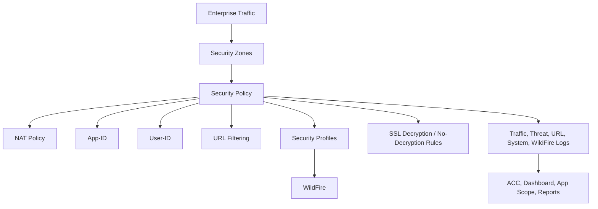

# Architecture

## Design Objective

The implementation models an enterprise NGFW deployed as the central enforcement point between internal users, acquired-company users, internal services, extranet services, the management network, and the internet.

## Logical Zones

| Zone | Role | Security Purpose |
|---|---|---|
| Users | Primary internal user network | Permit approved business applications and inspect outbound traffic |
| Acquisition | Newly acquired user network | Restrict users to approved corporate applications and group-based exceptions |
| Internal Services | Internal application or server resources | Limit access to required cross-zone flows |
| Extranet | Partner-facing or semi-trusted resources | Publish only approved services |
| Management | Administrative access network | Restrict firewall management access |
| Untrust / Internet | External network | Provide controlled outbound and inbound access through NAT and policy |

## Security Stack

## Evidence Boundary

The architecture is based on objectives and evidence from PAN-OS firewall labs covering Labs 02 through 13. Where direct configuration screenshots are unavailable, this repository uses the wording "validated through logs/evidence" instead of claiming direct visual proof of configuration screens.

